# Votex 🎓🗳️

Votex is a **College Election Management System** built using **Flutter** and **Supabase**. It enables digital elections with secure authentication, real-time voting, and transparent result announcements — all in a beautifully designed mobile app.

---

## 🚀 Features

- 🔐 OTP-based user authentication
- 🧑‍💼 Candidate registration with admin approval
- 📊 Real-time voting and live result dashboard
- 🗳️ One vote per verified user
- 👨‍💻 Admin panel to manage users, candidates & results
- 📱 Clean and modern UI with animations

---

## 🛠️ Tech Stack

- **Frontend:** Flutter
- **Backend:** Supabase (Auth + Realtime DB)
- **Languages:** Dart, SQL
- **State Management:** Provider
- **Design:** Custom UI/UX with animated transitions

---

## 📷 Screenshots
## 📷 Screenshots

  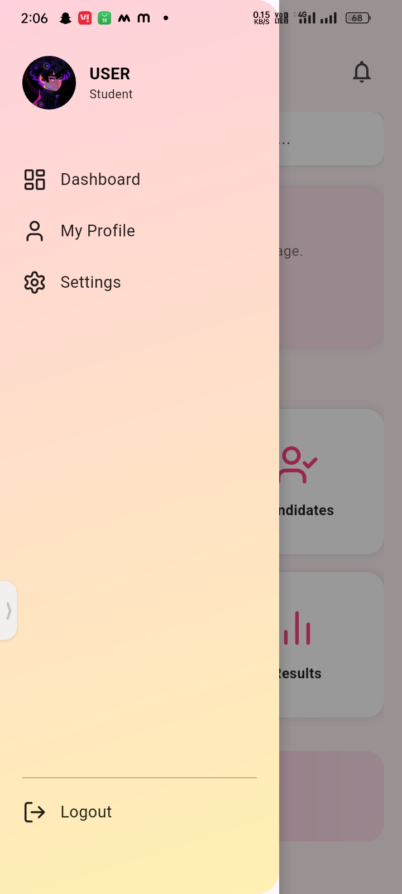
  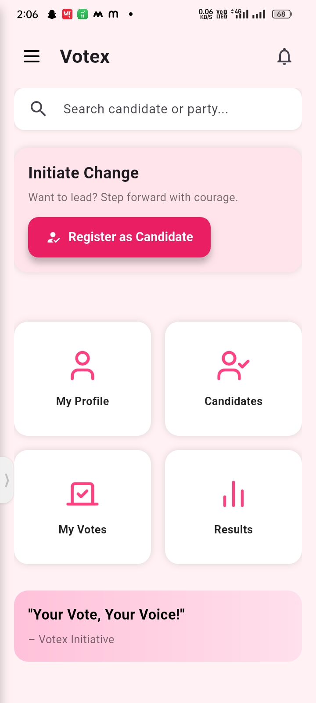
  
  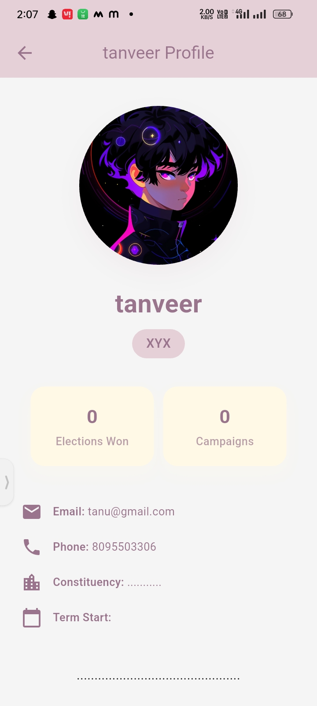
  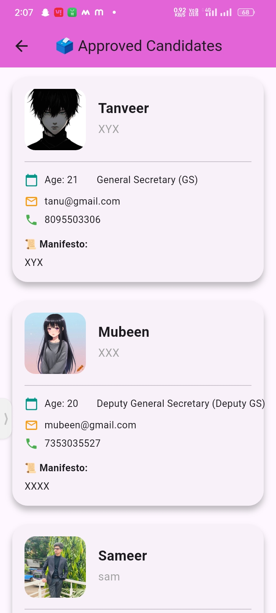
  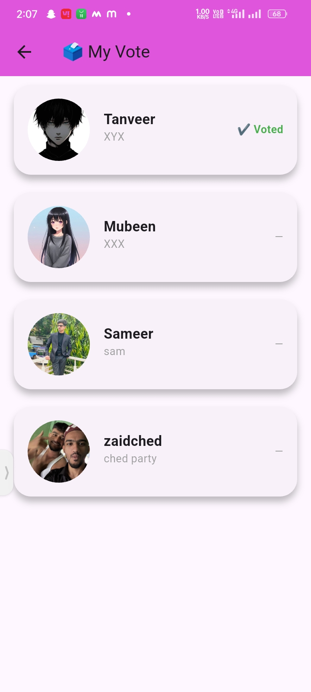
  
  
  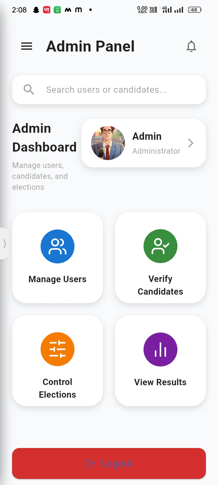
  
  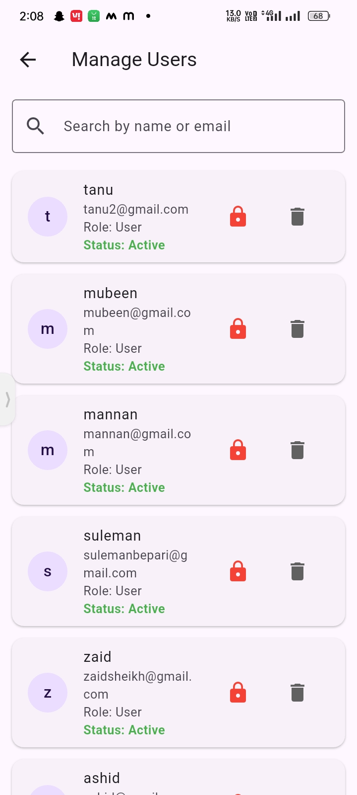
  
  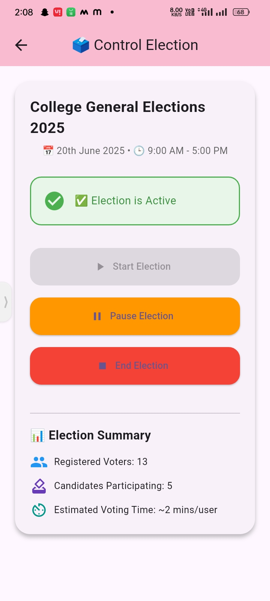
  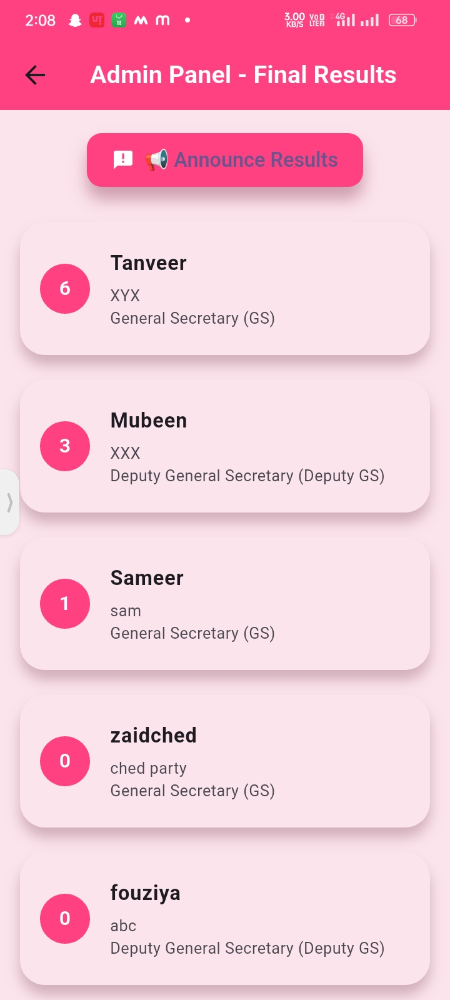
  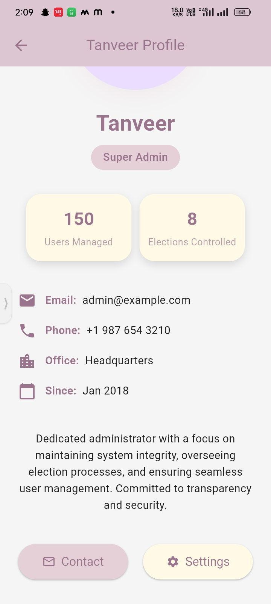
  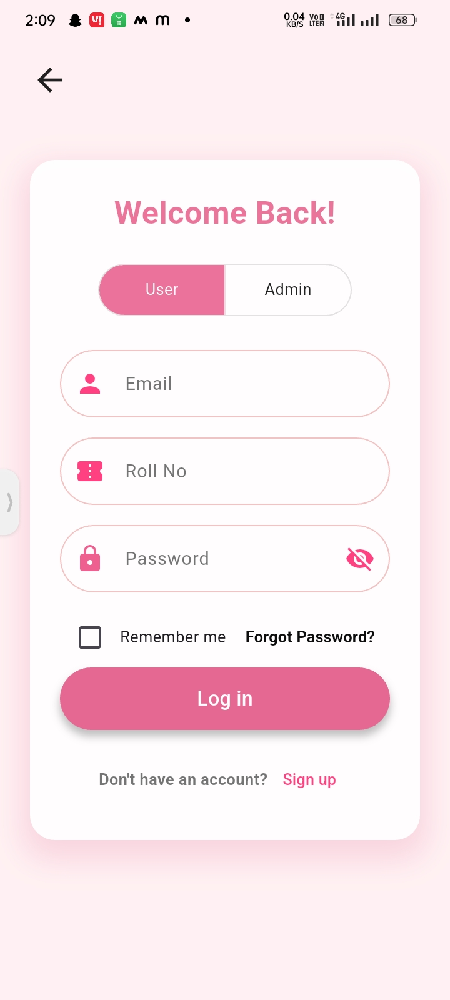
  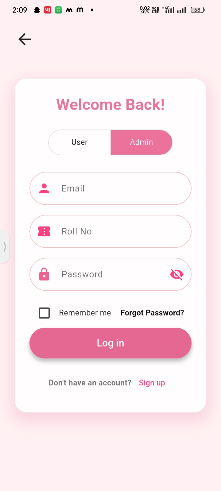
  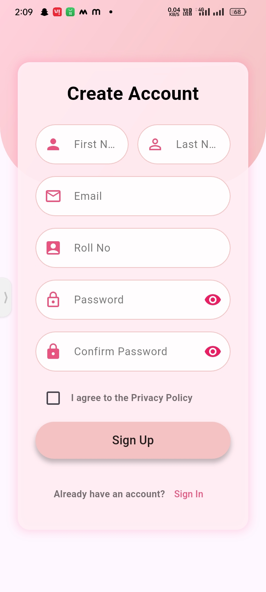
  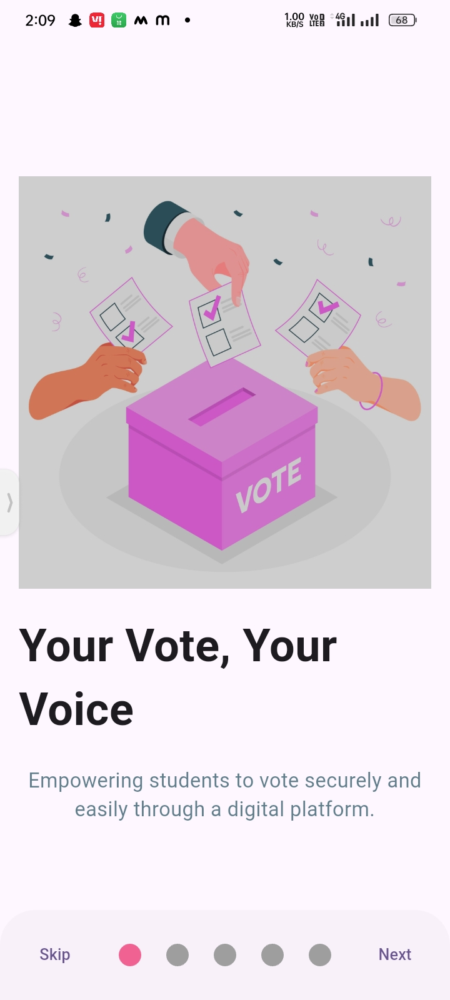
  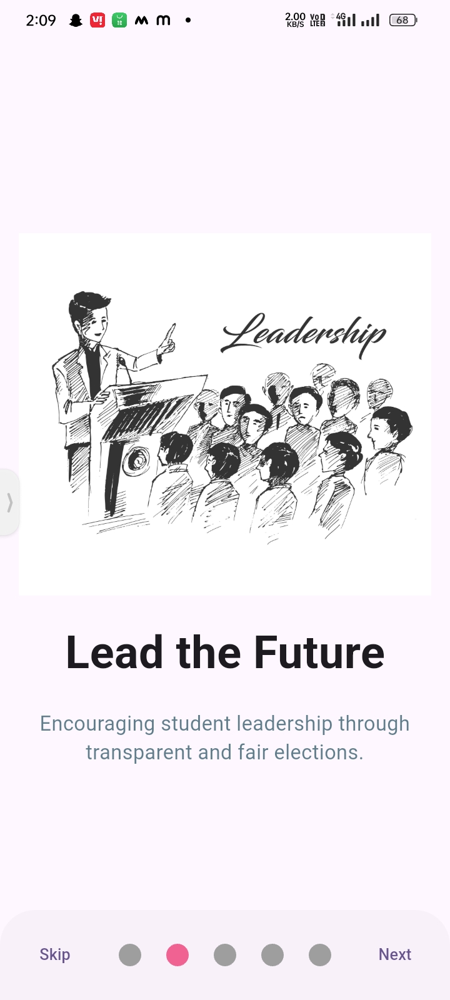
  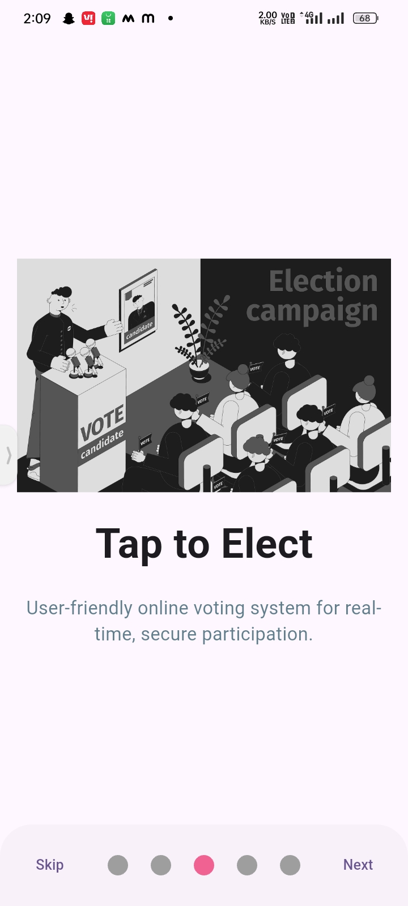
  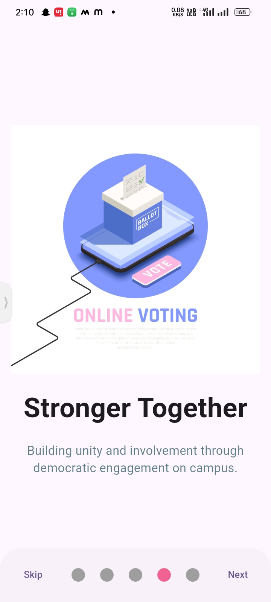
  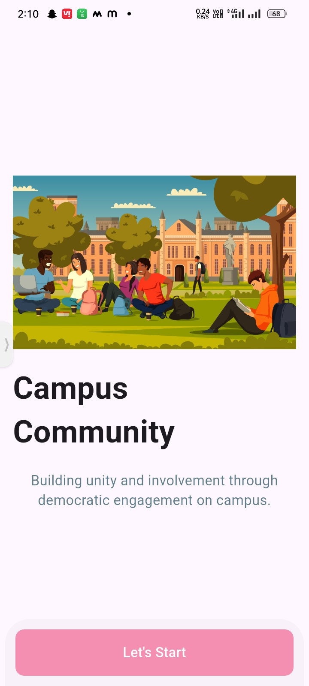

---

## 📌 Project Status

✅ MVP Completed  
🛠️ Ongoing Enhancements in UI/UX and Security

---

## 🤝 Contributors

- [Tanaveer Hayamad](https://www.linkedin.com/in/tanaveer-hayamad-809b44323/)

---

## 📎 License

This project is open-source and available under the [MIT License](LICENSE).

